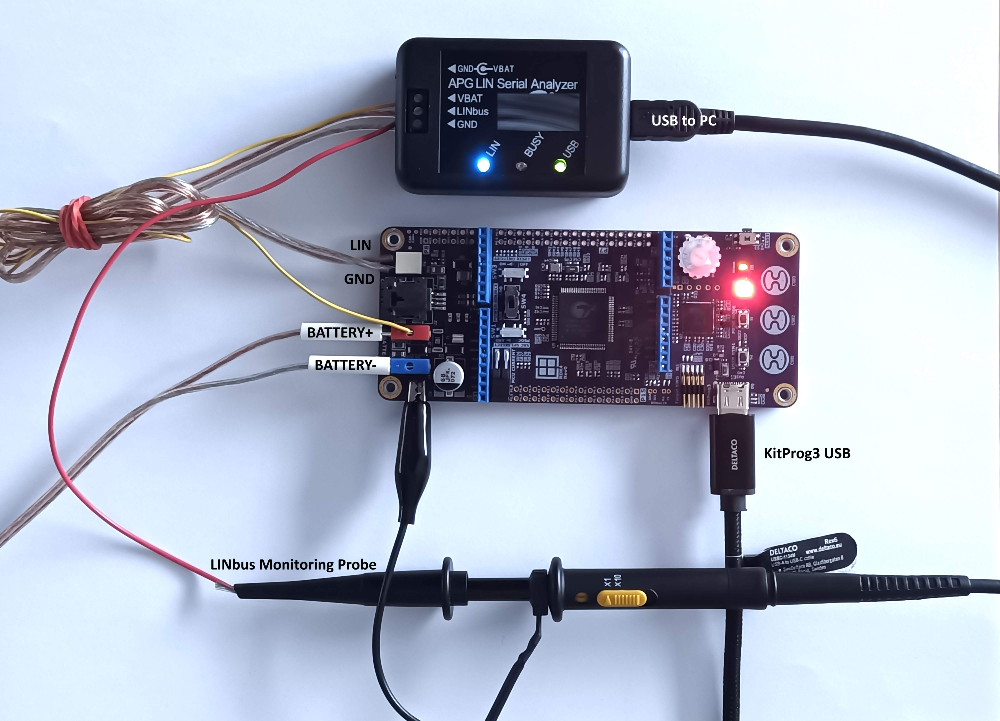
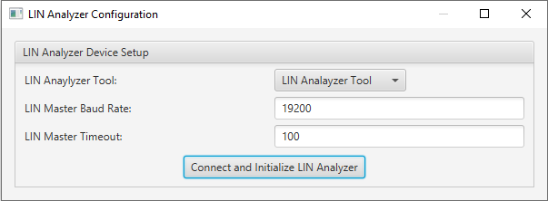
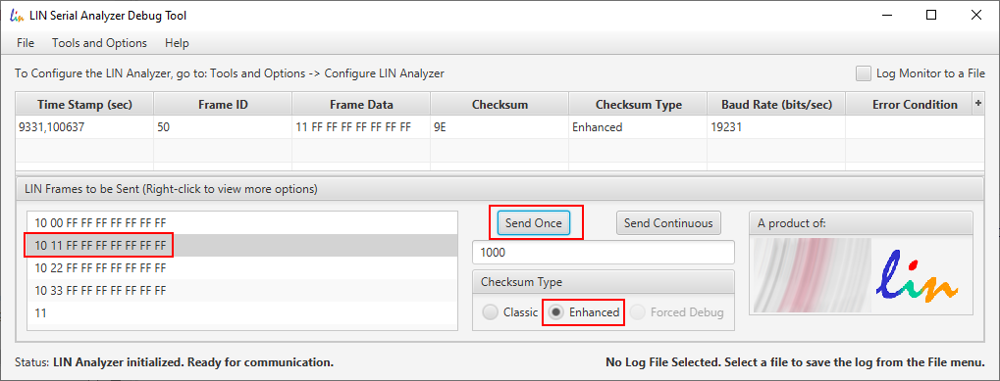
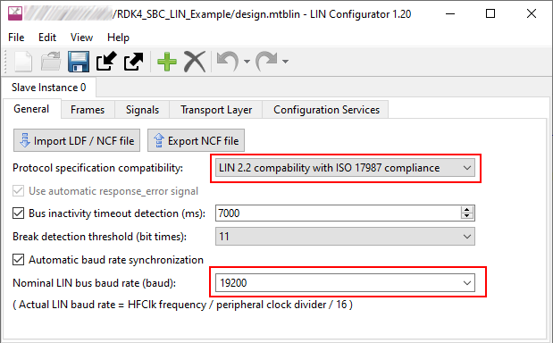
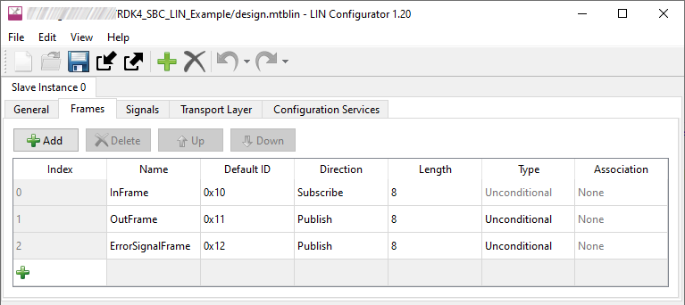
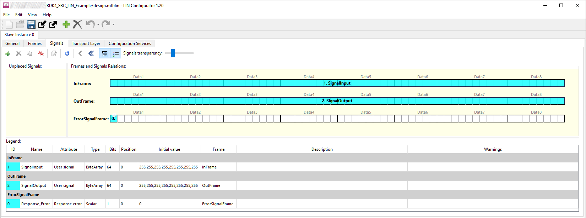
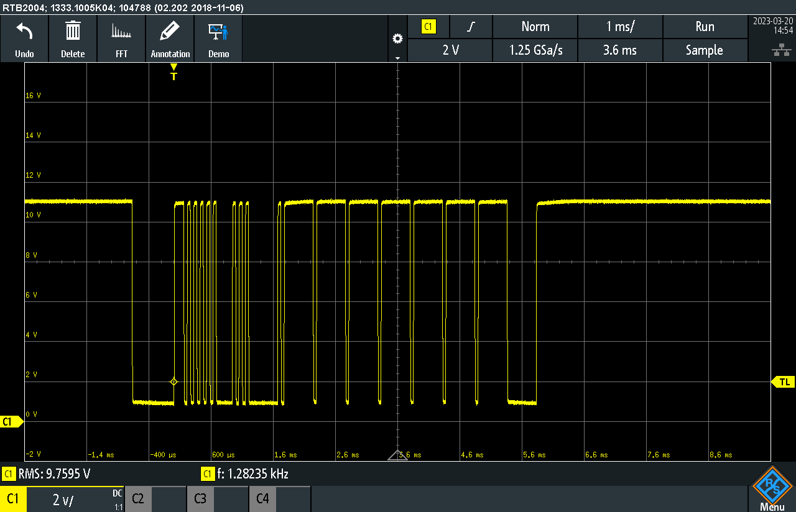
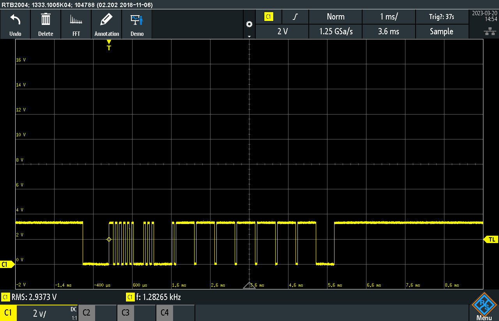
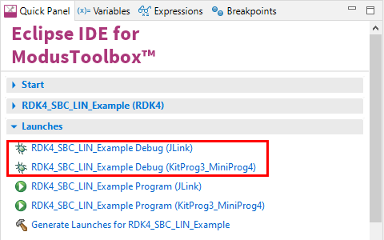

# RDK4 TLE9262-3BQX LIN Example

Rutronik Development Kit 4 Programmable System-on-Chip CY8C4149AZE-S598 "System Basis Chip Local Interconnect Network" Code Example. 

This code example demonstrates a LIN 2.2 ISO17987 connectivity using TLE9262-3BQX System Basis Chip. 

This code example project has derived from the "[PSoC™ 4: Basic LIN slave example in MTB](https://github.com/Infineon/mtb-example-psoc4-lin-slave)". 



## Requirements

- [ModusToolbox™ software](https://www.cypress.com/products/modustoolbox-software-environment) v3.0

### Using the code example with a ModusToolbox™ IDE:

1. Import the project: **File** > **Import...** > **General** > **Existing Projects into Workspace** > **Next**.
2. Select the directory where **"RDK4_SBC_LIN_Example"** resides and click  **Finish**.
3. Update the libraries using a **"Library Manager"** tool.
4. Select and build the project **Project ** > **Build Project**.

### Operation

The third party software "[LIN Serial Analyzer v3.0.0](https://www.microchip.com/en-us/software-library/lin_analyzer)" and the PC adapter "[APGDT001 LIN SERIAL ANALYZER](https://www.microchip.com/en-us/development-tool/APGDT001)" was used to demonstrate the RDK4 LIN Slave.

The software must be configured to work with 19.2 kbit/s baud rate, what is a maximum baud rate of the LIN 2.2.



Please add the frames as it is shown below and set the "Enhanced Checksum Type".

```
10 00 FF FF FF FF FF FF FF
10 11 FF FF FF FF FF FF FF
10 22 FF FF FF FF FF FF FF
10 33 FF FF FF FF FF FF FF
11
```



If the firmware is already programmed into the RDK4 and LIN is connected to the APGDT001 adapter as well as  the "Battery" power supply , the commands can be transmitted by pressing "Send Once or Send Continuous".

The first bite controls the RDK4 LEDs as it is shown below:

| Command | Slave response            |
| ------- | ------------------------- |
| 0x11    | Turns on LED1 (Red LED)   |
| 0x22    | Turns on LED2 (Green LED) |
| 0x33    | Turns on LED3 (Blue LED)  |
| 0x00    | Turns off all LEDs        |

The LIN configuration in ModusToolbox IDE is done using a tool called "LIN Configurator". 

The LIN baud rate and protocol is configured as it is shown in a figure below:



The LIN Frames are configured as it is shown in a figure below:



The LIN Signals are configured as it is shown in a figure below:



The LIN wire and LIN RX signals are shown in figures below:





### Debugging

If you successfully have imported the example, the debug configurations are already prepared to use with a the KitProg3, MiniProg4, or J-link. Open the ModusToolbox™ perspective and find the Quick Panel. Click on the desired debug launch configuration and wait for the programming to complete and the debugging process to start.



## Legal Disclaimer

The evaluation board including the software is for testing purposes only and, because it has limited functions and limited resilience, is not suitable for permanent use under real conditions. If the evaluation board is nevertheless used under real conditions, this is done at one’s responsibility; any liability of Rutronik is insofar excluded. 


