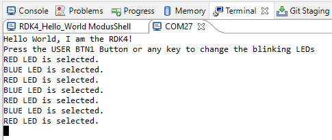
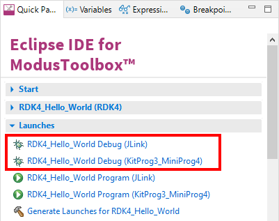

# RDK4 Hello World

Rutronik Development Kit 4 Programmable System-on-Chip CY8C4149AZE-S598 "Hello World" Code Example. 

This example is an introduction to the basic components of the board: LEDs, User Button 1 and KitProg3 UART for debug.

 

## Requirements

- [ModusToolbox™ software](https://www.cypress.com/products/modustoolbox-software-environment) v3.0

### Using the code example with a ModusToolbox™ IDE:

1. Import the project: **File** > **Import...** > **General** > **Existing Projects into Workspace** > **Next**.
2. Select the directory where **"RDK4_Hello_World"** resides and click  **Finish**.
3. Update the libraries using a **"Library Manager"** tool.
4. Select and build the project **Project ** > **Build Project**.

### Operation

The firmware example uses KitProg3 Debug UART for debug output. A Blue LED or Red LED is selected to blink once per second as a button USER_BTN1 is pressed once. Also LEDs are changed if any key code is sent to the terminal. Use your preferred terminal software to track the debug output or simply load a ModusToolbox™ native "Terminal" tool.

### Debugging

If you successfully have imported the example, the debug configurations are already prepared to use with a the KitProg3, MiniProg4, or J-link. Open the ModusToolbox™ perspective and find the Quick Panel. Click on the desired debug launch configuration and wait for the programming to complete and the debugging process to start.

## Legal Disclaimer

The evaluation board including the software is for testing purposes only and, because it has limited functions and limited resilience, is not suitable for permanent use under real conditions. If the evaluation board is nevertheless used under real conditions, this is done at one’s responsibility; any liability of Rutronik is insofar excluded. 

